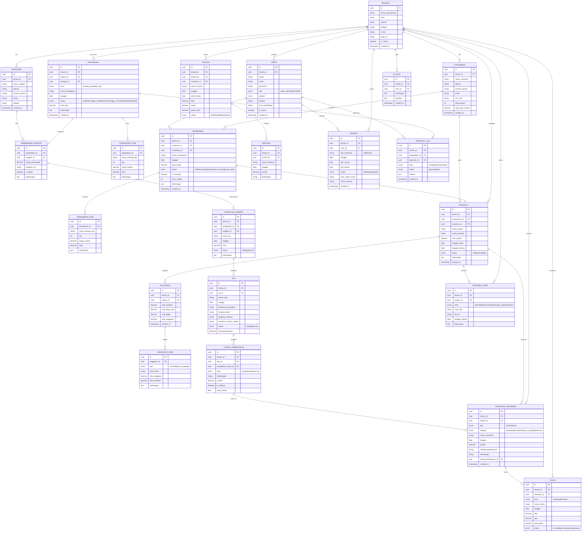

# Database Design (ERD)
## ERP SCM & Keuangan — PT Gemilang Agung Cemerlang

## Catatan Desain Database

1. **Multi-Tenancy**: Semua tabel memiliki `tenant_id` untuk isolasi data antar perusahaan.
2. **Approval Berjenjang**: `PENGADAAN` memiliki status bertahap. `APPROVAL_LOG` menyimpan jejak audit setiap approval/rejection.
3. **Face Recognition**: Kolom `face_embedding` di `USERS` menyimpan vektor wajah untuk Face ID attendance.
4. **Penawaran → Project**: Relasi 1:1 antara `PENAWARAN` (yang menang) dan `PROJECTS`.
5. **Anggaran Real-Time**: `ANGGARAN_ITEM.nilai_realisasi` diupdate otomatis dari transaksi pengadaan.
6. **Pajak**: Tabel `PAJAK` terpisah untuk monitoring Pajak Masukan & Keluaran per transaksi.
